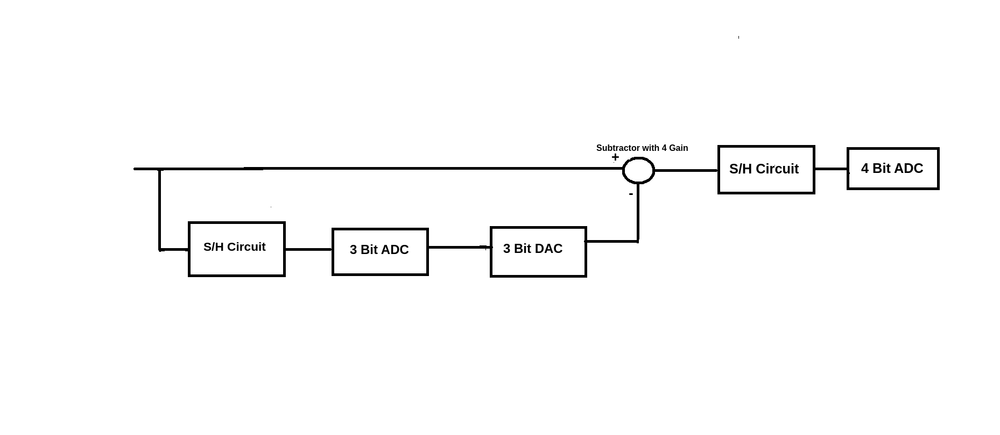
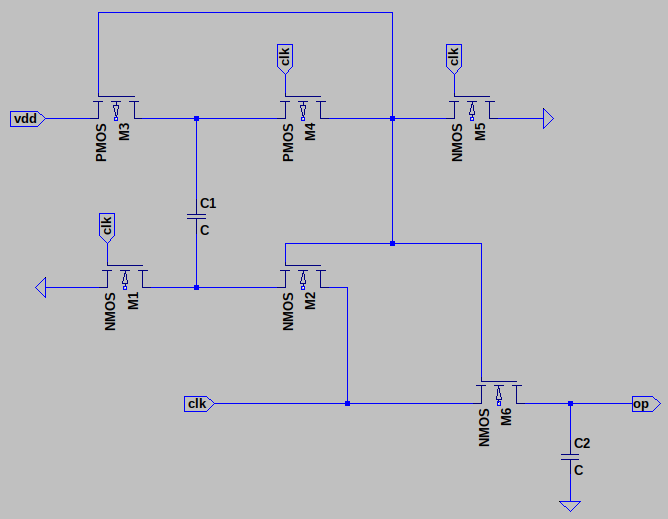
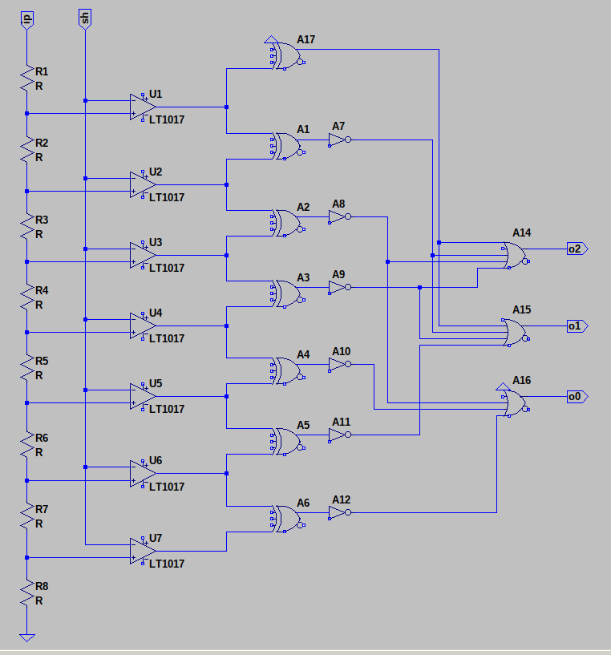
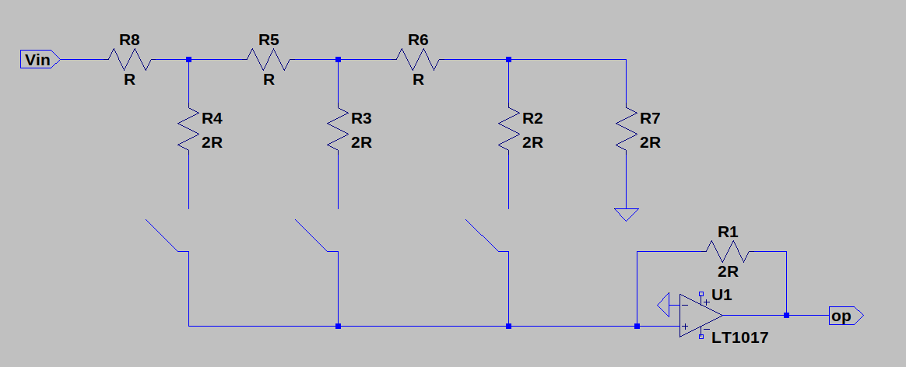
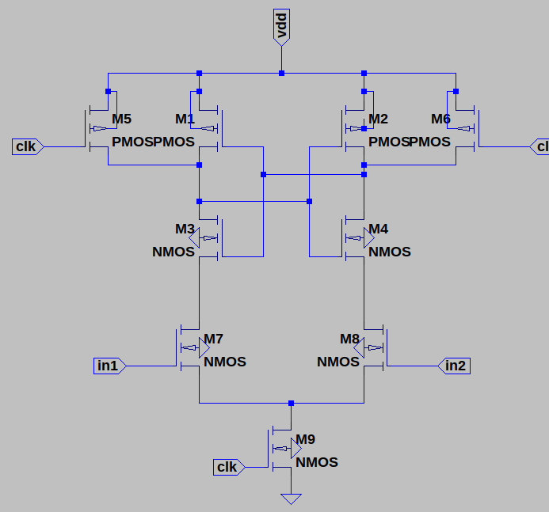
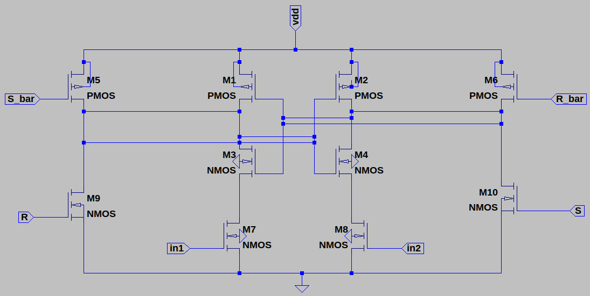

# Mixed Signal VLSI Design

## Group  
            EE23MT011 Kaushik Powar; EE23MT011@iitdh.ac.in
            EE23MT017 Sahil Bagade;  EE23MT017@iitdh.ac.in            
            
        
## Aim: 
            Design a 6 bit 2 step Flash ADC, using 3 bit ADC in first step and 4 bit ADC in second step.

## Circuit Block Diagram 

 

    
    
    
## Sub Circuit 
                        Bootstrap S/H Circuit

                        3 bit ADC

                        3 bit DAC

                        Sense

                        Comparator

                        

## Challenges 

            First, the s/h circuit used was the bottom plate sampling, the problem with using the bottom plate sampling was the output had an error due to charge injection/clock feedthrough.

            After replacing the bottom plate sampling ckt with the transmission gate, at the output, the capacitor was charging slowly when the capacitor of 1u F was connected and there were errors when the
            1f F was connected and the noise was getting introduced.

            The second S/H circuit is used to reduce the noise of the subtractor output
            
            The CLK in the second s/h is delayed by 1.7n.

             Finally, the S/H circuit used was Bottom plate sampling because the practical transmission gate is not used therefore other s/h circuits are preferred.

                        Differential Amplifier and Subtractor

            The problem with the differential amplifier was the gain we were getting was different for different inputs.
            This problem was solved by replacing the differential amplifier with the vcvs with a gain of 4.

                        3 Bit ADC
            
            Initially, we took 14um/28um mosfet width which gave an error while testing, we reduced it to 1um/2um.
            Sense comparator was introducing kickback noises in ADC Vref level therefore preamplifiers were added to the circuits
            The preamp that was near the ground was giving errors because they were NMOS preamps, so we replaced preamps near the ground with PMOS preamps
            
            
                        3 Bit DAC

            The voltage we got at the nodes was not the same as expected. First, we used nmos and pmos in parallel, The problem with that circuit was the mos resistance  which was hard to compensate
            , due to which the division of voltage was not proper, the expected division was Vref/2, Vref/4, Vref/8.This problem was rectified by replacing the switch with two NMOS in parallel and 
            connecting the inverter to the gate of NMOS and its source is connected to the ground. So that when the input 0 is given to DAC inverted NMOS will be turned on and it will be shorted to ground.

            Ideal opamp was implemented using VcVs

            

            

            

            

